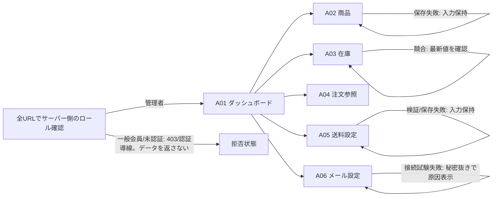

# 画面遷移と復帰導線

画面IDは詳細設計書§3と同じキーであり、外部Stripe Checkoutは画面IDを割り当てない。ノード内の「条件」は同一画面の状態を表す。全遷移は同一サイト内の相対パスを基本とし、認証後の復帰先は安全な同一サイト内URLに限定する。

## 公開商品から購入まで

```mermaid
flowchart TD
  S01["S01 トップ"] -->|カテゴリ| S02["S02 カテゴリ"]
  S01 -->|検索| S03["S03 検索"]
  S01 -->|商品| S04["S04 商品詳細"]
  S01 -->|構成確認| S05["S05 構成確認"]
  S02 -->|商品を選択| S04
  S03 -->|商品を選択| S04
  S02 -.->|0件: 条件解除| S02
  S03 -.->|0件: 条件を保持して解除| S03
  S04 -->|構成へ追加| S05
  S04 -->|カートへ追加| S06["S06 カート"]
  S05 -->|条件に合う商品| S02
  S05 -->|検索条件を指定| S03
  S05 -->|構成商品を開く| S04
  S05 -->|互換性の警告を残して購入| S06
  S06 -->|未ログインで購入| S07["S07 ログイン"]
  S06 -->|会員で購入| S12["S12 配送先"]
  S07 -->|認証後の安全な復帰先| S12
  S07 -->|ログイン成功/通常| S15["S15 マイページ"]
  S07 -->|新規登録| S08["S08 登録"]
  S07 -->|パスワード再設定| S10["S10 再設定"]
  S08 -->|メール確認と模擬SMS| S09["S09 確認"]
  S09 -->|両確認後: 通常| S15
  S09 -->|購入中の安全な復帰先| S12
  S10 -->|再設定完了| S07
  S12 -->|保存先を選択/入力| S13["S13 注文確認"]
  S12 -->|配送先を管理| S11["S11 配送先管理"]
  S11 -->|戻る/購入を続ける| S12
  S13 -->|確定額確認後にCheckout開始| STRIPE["Stripe Checkout テスト"]
  STRIPE -->|戻り先。サーバー状態を取得| S14["S14 決済結果"]
  S14 -.->|Webhook未着: 確認中・再読込| S14
  S14 -->|決済成功をサーバー確認| S17["S17 注文詳細"]
  S14 -->|注文一覧| S16["S16 注文履歴"]
  S14 -->|失敗/期限切れ: 再試行準備| S06
  S15 -->|配送先| S11
  S15 -->|注文履歴| S16
  S15 -->|ログアウト/削除完了| S01
  S16 -->|注文| S17
  S17 -->|注文履歴へ戻る| S16
```

## 管理画面

## 遷移条件の確認表

| 起点 | 条件/操作 | 到着 | 表示・保持すること |
| --- | --- | --- | --- |
| S01 | 用途に掲載商品がない | S02 | 用途案内を残し、カテゴリ探索へ進める |
| S02/S03 | 結果0件 | 同画面 | 条件/検索語を残し、条件を解除できる |
| S04 | 追加時点で販売可能数不足 | S04 | 最新数、原因、数量再指定。無効なカート追加はしない |
| S05 | 不一致または判定不能 | S05→S06可能 | 比較値/不足仕様と理由。警告は残すがカート・購入を妨げない |
| S06 | 未認証で購入 | S07→認証後S12 | 安全な同一サイトの復帰先のみ保持 |
| S08/S10 | メール/SMS期限切れ・再送制限 | 同画面 | 入力を保ち、再発行できる時点と次操作を表示 |
| S12 | 住所なし | S12 | 追加フォームを表示しS13へ続行可能 |
| S12 | カート空/売切れ | S06 | 理由と該当商品を示し、変更・探索に戻る |
| S13 | 再計算で金額差異 | S13 | 更新後の正式額を表示し、再確認するまでCheckout開始しない |
| S13 | 正式送料を算定できない | S13 | 算定不能の理由。決済開始を提供しない |
| S14 | 戻りURL到着、Webhook未着 | S14 | 未確定を確認中と表示。画面上で成功に昇格させない |
| S17 | 他会員の注文ID | S17相当の404 | 注文の存在・所有者を示さない |
| A01–A06 | 管理者権限なし、URL直打ち | 拒否状態 | API/サーバーも拒否。画面リンク非表示だけにしない |

## 共通の操作・復帰規則

- 検索条件はURLクエリに保持し、0件・読込失敗・更新失敗で消さない。フォーム検証失敗でも他の入力を維持する。
- 互換性の警告はS05の詳細とS13の短い要約で表示する。確認モーダルは破棄操作に限り、警告を何度も再確認させない。
- エラーを起点画面に表示し、原因・次にできる操作・復帰先を同じ画面上で説明する。認証切れ時のみS07へ移動し、完了後は安全に元の目的へ戻す。
- 削除など取り消せない操作は対象を明記した確認を行う。決済成功、価格、送料、在庫、権限をブラウザ状態だけで決めない。
- フォーカスはエラー要約または遷移先見出しに一度だけ移す。更新後の一覧は該当一覧見出しへ移り、キーボード利用者へ件数/状態変更を通知する。
